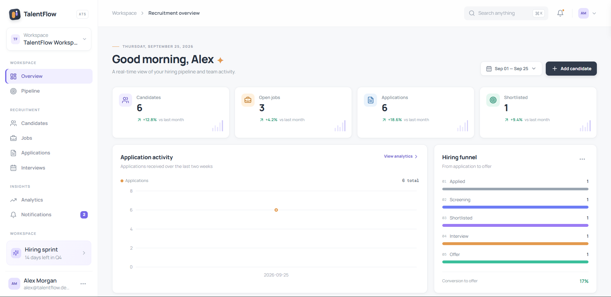
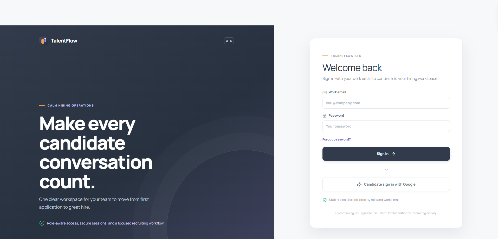
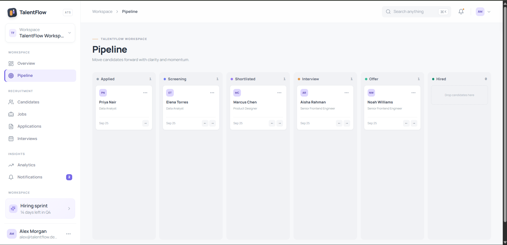

# TalentFlow ATS

> A modern full-stack Applicant Tracking System designed to manage the complete recruitment lifecycle — from candidate intake and application tracking to interviews, hiring pipeline management, and recruitment analytics.

<p align="center">
  
</p>

<p align="center">
  <strong>Recruitment workspace built with React, TypeScript, Express, tRPC, Drizzle ORM and MySQL.</strong>
</p>

---

## 📸 Product Preview

### 🔐 Authentication

<p align="center">
  
</p>

TalentFlow provides separate authentication flows for internal recruiting staff and candidates.

- Staff authentication using work email and password
- Candidate authentication using Google
- Role-aware access control
- Secure session management
- Protected recruitment workspace

---

### 📊 Recruitment Dashboard

<p align="center">
  
</p>

The recruitment dashboard provides a real-time overview of:

- Candidate volume
- Open jobs
- Applications
- Shortlisted candidates
- Application activity
- Hiring funnel
- Recruitment analytics

---

### 🧩 Candidate Pipeline

<p align="center">
  
</p>

The Kanban-style recruitment pipeline allows teams to visualize candidate progression across hiring stages:

**Applied → Screening → Shortlisted → Interview → Offer → Hired**

---

### 📅 Interview Management

<p align="center">
  
</p>

The interview workspace provides a centralized view of upcoming interviews and recruitment activity.

---

## 🚀 Key Features

### Recruitment Management

- Candidate management
- Job management
- Application tracking
- Recruitment pipeline
- Interview management
- Recruitment analytics
- Notifications
- Candidate portal

### Authentication & Security

- Work email + password authentication for internal staff
- Google authentication for candidates
- Role-based access control
- Protected API procedures
- Secure HTTP-only sessions
- Password reset flow
- Authentication rate limiting
- Audit logging
- Security headers

### Recruitment Roles

| Role           | Access                                     |
| -------------- | ------------------------------------------ |
| Admin          | Full recruitment workspace                 |
| Recruiter      | Candidate, job and application management  |
| Hiring Manager | Hiring workflow and candidate review       |
| Interviewer    | Interview-related workflows                |
| Candidate      | Own applications and interview information |

---

## 🏗️ Architecture

```text
                    ┌─────────────────────┐
                    │      React UI       │
                    │  TypeScript + Vite  │
                    └──────────┬──────────┘
                               │
                               │ tRPC
                               ▼
                    ┌─────────────────────┐
                    │   Express Server    │
                    │    tRPC API Layer   │
                    └──────────┬──────────┘
                               │
                    ┌──────────▼──────────┐
                    │     Drizzle ORM     │
                    └──────────┬──────────┘
                               │
                    ┌──────────▼──────────┐
                    │    MySQL Database   │
                    └─────────────────────┘
```
